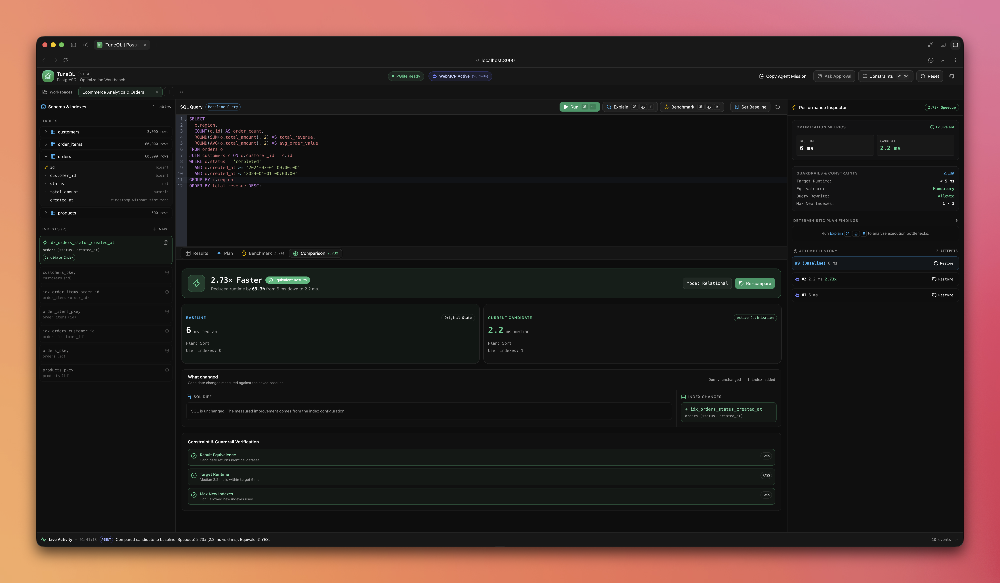
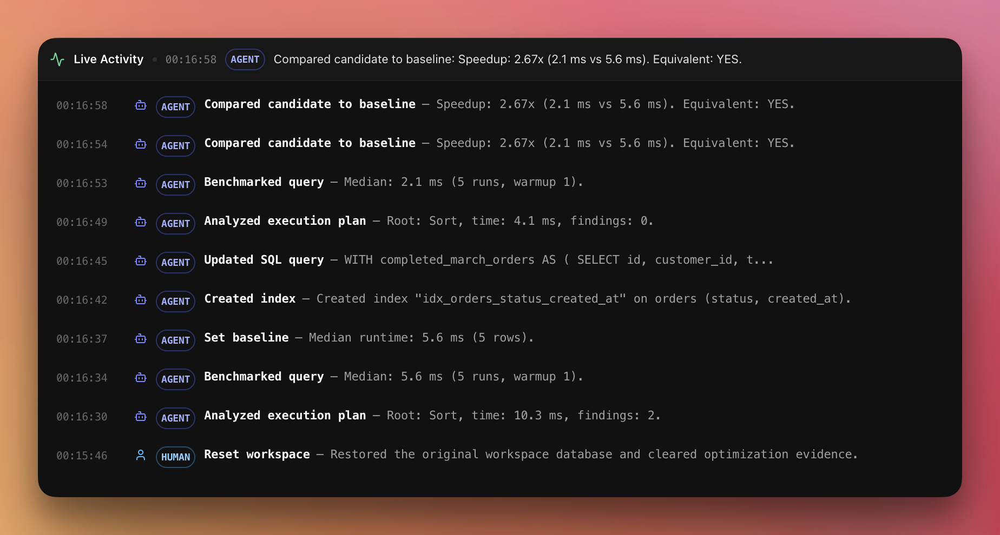

# TuneQL

TuneQL is a PostgreSQL query optimization workbench that runs in the browser using PGlite.

You can run a query, inspect its execution plan, save a baseline, try query or index changes, benchmark them, and check whether the result is still the same. Data and workspace state stay in the browser.

## Features

- PostgreSQL running in the browser with PGlite
- Multiple persistent workspaces
- SQL editor with schema and index details
- `EXPLAIN ANALYZE` plan viewer and findings
- Configurable benchmarks with median, minimum, and maximum time
- Baseline and candidate comparison
- Result-equivalence check with duplicate row support
- Index creation with workspace limits
- Attempt history and restore
- ZIP export with SQL, workspace metadata, and Markdown report

Benchmark numbers are local measurements. They should be used for comparison, not as production performance numbers.

## Screenshots

### PostgreSQL optimization workbench



### WebMCP agent optimization



## WebMCP

TuneQL registers 20 WebMCP tools using `document.modelContext`. The UI and WebMCP tools use the same workspace commands, so changes made by an agent are shown in the UI.

| Tool                      | What it does                                                            |
| ------------------------- | ----------------------------------------------------------------------- |
| `get_workspace_summary`   | Gets the active workspace summary, revision, baseline, and constraints. |
| `list_workspaces`         | Lists saved workspaces and the active workspace.                        |
| `open_workspace`          | Opens a saved workspace.                                                |
| `create_workspace`        | Creates an Ecommerce, empty, or SQL workspace.                          |
| `rename_workspace`        | Renames a workspace.                                                    |
| `delete_workspace`        | Deletes a workspace.                                                    |
| `get_optimization_report` | Returns the Markdown optimization report.                               |
| `get_schema`              | Gets tables, columns, types, and row counts.                            |
| `get_indexes`             | Gets indexes and their protected status.                                |
| `get_active_query`        | Gets the SQL currently open in the editor.                              |
| `set_active_query`        | Updates the active read-only SQL query.                                 |
| `explain_query`           | Runs PostgreSQL `EXPLAIN` or `EXPLAIN ANALYZE`.                         |
| `benchmark_query`         | Benchmarks the active query using workspace settings.                   |
| `set_baseline`            | Saves the current query and indexes as the baseline.                    |
| `compare_to_baseline`     | Checks speed, constraints, and result equivalence.                      |
| `create_index`            | Creates a B-tree index after checking workspace limits.                 |
| `drop_index`              | Drops an index created during optimization.                             |
| `get_constraints`         | Gets the current optimization constraints.                              |
| `list_attempts`           | Lists saved optimization attempts.                                      |
| `restore_attempt`         | Restores a previous query and index state.                              |

Workspace create, open, rename, and delete tools need Full Access from the user. It is off by default. Other tools work on the workspace selected in the UI.

WebMCP needs a browser or host that supports `document.modelContext`. The app works normally when WebMCP is not available.

## Getting started

Requirements: Node.js 20+ and pnpm.

```bash
git clone https://github.com/jaipaljadeja/TuneQL.git
cd TuneQL
pnpm install
pnpm dev
```

Open [http://localhost:3000](http://localhost:3000).

On first run, TuneQL opens a sample Ecommerce workspace so you can try the app immediately. It can be renamed, reset, or deleted at any time. If no workspace remains, the app shows its empty state. You can add the seeded Ecommerce demo again from **Create Workspace**.

Run all checks with:

```bash
pnpm lint
pnpm typecheck
pnpm test
pnpm build
```

## License

[MIT](LICENSE)
